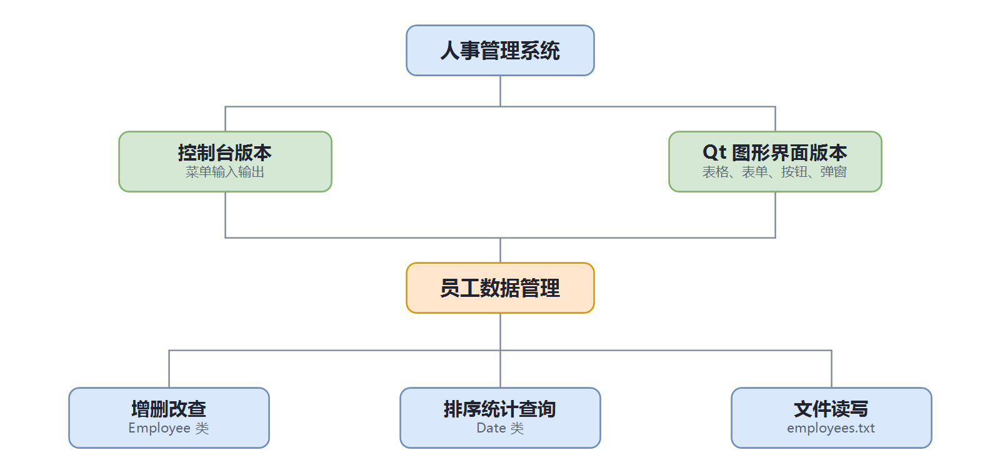

# 人事管理系统 (Personnel Management System)

一个用 **C++17** 编写的人事管理系统,提供**控制台版**和 **Qt 图形界面版**两种界面,功能一致、数据互通。本项目用于练习面向对象程序设计与文件持久化。

## ✨ 功能特性

- 员工信息的**增加、删除、修改、查询、显示**
- **高级查询**:按部门、薪水区间、职务关键字
- **排序**:按工作证号、生日、薪水
- **统计分析**:部门人数、薪水总额 / 平均 / 最高 / 最低
- **文件持久化**:数据以文本文件保存,控制台版与图形界面版**共用同一份数据**
- **输入校验**:身份证、电话、日期(含闰年判断)、薪水格式;工作证号唯一
- 图形界面关闭时提示保存,避免误关丢数据

## 🛠 技术栈

- **C++17**(标准库 `vector` / `string` / 文件流)
- **Qt 5 Widgets**(图形界面版,`qmake` 构建)
- 面向对象设计:`Date`、`Employee`、`EmployeeList` 等类

## 📁 项目结构

```
.
├── src/                  控制台版源码
│   ├── main.cpp
│   ├── personnel_system.h
│   └── personnel_system.cpp
├── qt_gui/               图形界面版源码
│   ├── main.cpp
│   ├── personnel_gui.h
│   ├── personnel_gui.cpp
│   └── personnel_gui.pro
├── data/
│   └── employees.txt     示例数据
├── Makefile              构建脚本
├── 使用手册.md            详细使用说明
├── 运行说明.md            编译/运行环境说明
├── 系统总框架图.png        系统框架图
└── README.md
```

## 🚀 编译与运行

### 控制台版

```sh
g++ -std=c++17 -Wall -Wextra src/main.cpp src/personnel_system.cpp -o personnel_system
./personnel_system
```

也可使用 Makefile:`make`(编译) / `make run`(编译并运行)。

### 图形界面版(需安装 Qt 5)

```sh
cd qt_gui
qmake personnel_gui.pro
make            # Windows(MinGW)上用 mingw32-make
```

## 🖼 系统框架



## 📖 使用说明

- 详细操作:见 [使用手册.md](使用手册.md)
- 构建/运行环境:见 [运行说明.md](运行说明.md)

## 📝 许可证

本项目仅用于学习与交流。
