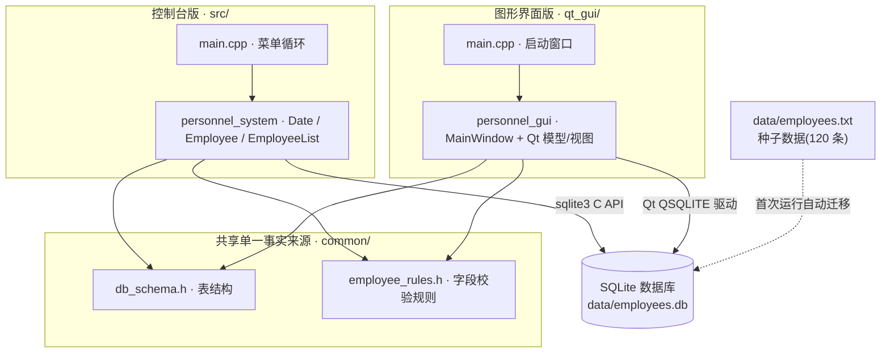
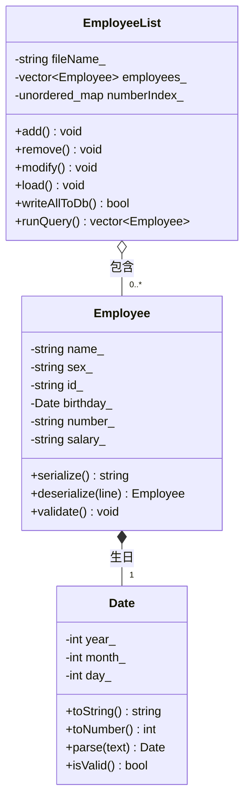
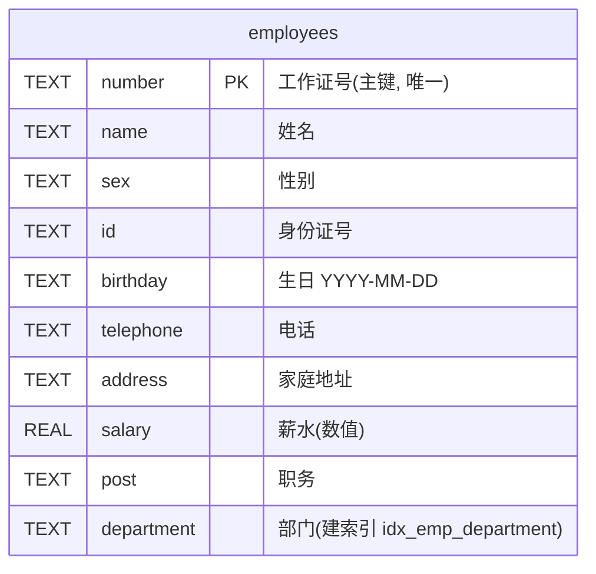
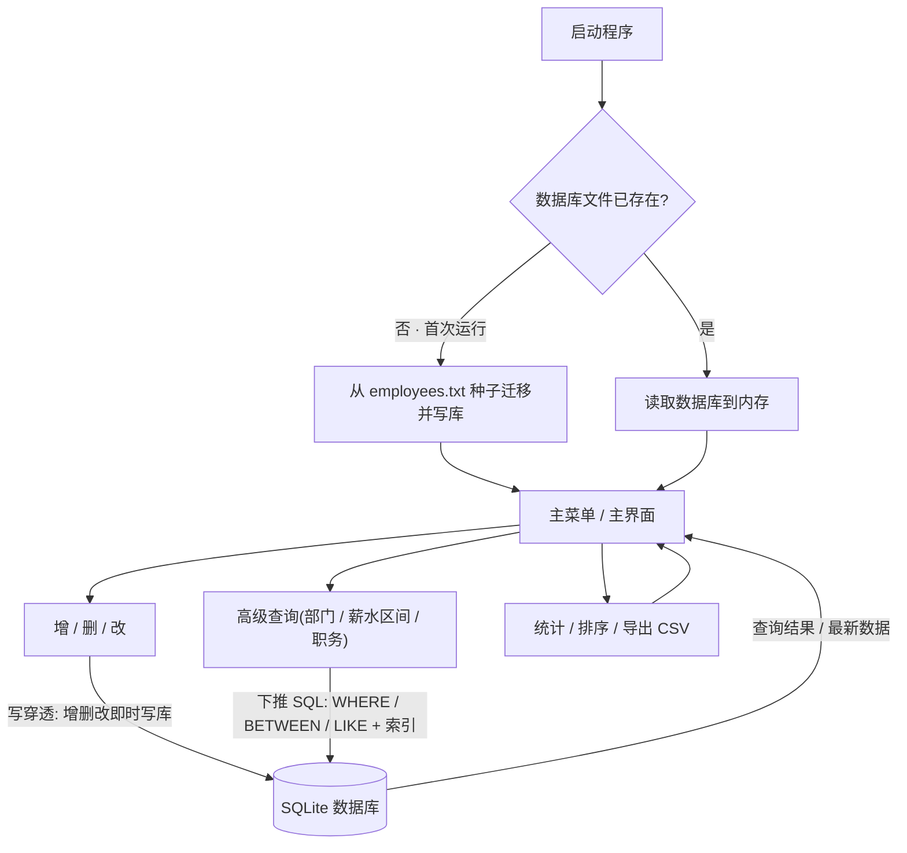

<div align="center">

# 人事管理系统 · Personnel Management System

一个用 **C++17** 编写的人事管理系统,提供**控制台版**与 **Qt 图形界面版**两种界面,功能一致、数据互通。
面向对象程序设计练习项目 —— 演示类设计、SQLite 数据库持久化、输入校验与图形界面开发。

**📚 适合正在做同类课程设计的同学参考**:双界面 + SQLite + 单元测试 + CI 全套工程化,非教科书式的"单文件 + txt"。


**[⬇️ 下载 Windows 免安装版](https://github.com/qw798124012700qw/personnel-management-system/releases/latest)** · 解压双击即用,无需装 Qt   |   觉得有用请点个 ⭐ Star 支持一下

</div>

## 📚 目录

- [简介](#-简介) · [界面预览](#️-界面预览) · [功能特性](#-功能特性) · [设计与实现](#-设计与实现)
- [技术栈](#️-技术栈) · [项目结构](#-项目结构) · [快速开始](#-快速开始) · [数据存储](#-数据存储)
- [使用说明](#-使用说明) · [可改进方向](#️-可改进方向-roadmap) · [许可证](#-许可证)

## 📖 简介

当企事业单位的员工信息依靠纸质表格或零散电子表格维护时,容易出现查找慢、修改不及时、数据重复等问题。本系统将员工资料集中管理,支持**录入、查询、修改、删除、排序、统计与数据库存取**,并提供命令行与图形界面两种使用方式。

选用 C++ 的原因:面向对象特性适合把"员工、日期、员工列表"抽象为类;标准库的 `vector`、`string` 便于动态存储与字符串处理,数据持久化交给嵌入式数据库 SQLite。

## 🖥️ 界面预览


> 上图为图形界面版主表格(含示例数据)。下方还有"员工信息"编辑表单与"添加 / 修改 / 删除 / 保存 / 统计 / 排序"等操作按钮(见[功能特性](#-功能特性))。

## ✨ 功能特性

**数据管理**
- 📝 员工的**增加、删除、修改**(身份证、电话、日期、薪水格式校验;工作证号唯一)
- 📋 **显示**全部员工摘要;**清空**全部记录(需确认)

**查询与排序**
- 🔍 **查找**:按姓名(模糊)或工作证号(精确)
- 🎯 **高级查询**:按部门(精确)、薪水区间(自动校正上下限)、职务关键字(模糊);**控制台版下推到 SQL**(`WHERE` / `BETWEEN` / `LIKE` + 部门索引)
- ↕️ **排序**:按工作证号、生日、薪水

**统计与持久化**
- 📊 **统计分析**:部门人数;薪水总额 / 平均 / 最高 / 最低
- 💾 **SQLite 数据库持久化**:控制台版用 SQLite C API、图形界面版用 Qt SQL 模块,**两种界面共用同一个数据库** `data/employees.db`;**两端均以数据库为实时数据源**(增删改即时写库,无需手动保存);**首次运行自动从旧文本文件迁移**;读取时自动跳过异常记录

**图形界面专属**
- 🔐 **登录与角色权限**:启动选择身份(管理员 / 只读访客),只读访客禁用一切写操作;所有增删改 / 撤销 / 导入写入**审计日志**(可弹窗查看)
- 🖱️ 表格点击行即载入表单编辑、点列头排序;关键字即时筛选;统计结果弹窗
- ↩️ **撤销 / 重做**:多级回退或恢复增 / 删 / 改,支持快捷键 `Ctrl+Z` / `Ctrl+Y`
- 📐 **记忆列宽与排序状态**:下次启动自动恢复(基于 QSettings)
- 📤 **导入 / 导出 CSV**:导出当前数据(UTF-8 带 BOM,Excel / WPS 直接打开);从 CSV 导入(逐行校验、按工作证号去重、跳过非法行)
- 🪟 **关闭窗口时提示保存**,避免误关丢数据
- 🖥️ **高 DPI 适配** + 窗口尺寸**自适应屏幕**

## 🧩 设计与实现

控制台版采用三个核心类,职责单一、相互解耦:

| 类 | 职责 |
| --- | --- |
| `Date` | 日期的输入、格式化、合法性校验(含闰年判断) |
| `Employee` | 单个员工的字段封装、录入 / 输出 / 序列化 / 修改 |
| `EmployeeList` | 员工集合的增删改查、排序、统计与数据库读写(内部用 `vector` 顺序表) |

技术点:运算符重载(`<<` / `>>`)、函数重载、`std::sort` + 静态比较函数、异常处理(容错读取,自动跳过异常记录)。

图形界面版使用 `QMainWindow` + `QTableView` / `QStandardItemModel` / `QSortFilterProxyModel`,通过信号槽连接按钮事件,与控制台版**共用同一个 SQLite 数据库**(图形界面通过 Qt SQL 模块的 `QSQLITE` 驱动访问)。

### 模块架构

控制台版与图形界面版是两套独立可执行程序,但**共用** `common/` 下的表结构与校验规则,并读写**同一个 SQLite 数据库**——既各自独立,又口径一致、数据互通。



### 类设计(控制台版)

三个核心类构成清晰的"组合"关系:`EmployeeList` 聚合多个 `Employee`,每个 `Employee` 内含一个 `Date`(生日)。字段全部私有 + 访问器,体现封装。



## 🛠️ 技术栈

| 部分 | 技术 |
| --- | --- |
| 语言 | C++17(`vector` / `string` / 文件流 / 异常) |
| 图形界面 | Qt 5 Widgets(`qmake` 构建) |
| 数据存储 | SQLite 3(控制台用 C API,图形界面用 Qt 5 Sql 的 `QSQLITE` 驱动;表结构见 `common/db_schema.h`) |
| 测试 / CI | 自带轻量断言框架(`make test`)+ GitHub Actions 自动构建 |
| 设计 | 面向对象、MVC(模型 / 视图 / 代理) |

## 📁 项目结构

```
.
├── src/                  控制台版源码
│   ├── main.cpp
│   ├── personnel_system.h
│   └── personnel_system.cpp
├── qt_gui/               图形界面版源码
│   ├── main.cpp
│   ├── personnel_gui.h
│   ├── personnel_gui.cpp
│   └── personnel_gui.pro
├── common/               两端共用的单一事实来源
│   ├── db_schema.h       数据库表结构
│   └── employee_rules.h  字段校验规则(性别/身份证/电话/薪水)
├── tests/test_core.cpp   核心逻辑单元测试(make test)
├── .github/workflows/    GitHub Actions CI 配置
├── data/employees.txt    种子数据(120 条；首次运行自动导入 SQLite 数据库)
├── Makefile              构建脚本
├── 使用手册.md / 运行说明.md
├── architecture.png      系统框架图
├── screenshot-gui.png    界面截图
└── README.md
```

## 🚀 快速开始

> 💡 **不想编译?** 直接到 [Releases](https://github.com/qw798124012700qw/personnel-management-system/releases/latest) 下载 Windows 免安装包,解压双击 `人事管理系统.exe` 即可运行(无需安装 Qt)。下面是从源码构建的方式。

### 控制台版

```sh
# 需安装 SQLite 开发库(头文件 sqlite3.h + 链接 -lsqlite3)
g++ -std=c++17 -Wall -Wextra src/main.cpp src/personnel_system.cpp -o personnel_system -lsqlite3
./personnel_system
```

或使用 Makefile:`make`(编译) / `make run`(编译并运行) / `make test`(运行单元测试)。

### 图形界面版(需安装 Qt 5)

```sh
cd qt_gui
qmake personnel_gui.pro    # .pro 已含 QT += sql
make                       # Windows(MinGW)上用 mingw32-make
```

> 图形界面通过 Qt SQL 模块访问数据库;`QSQLITE` 驱动随 Qt 提供,运行时需位于 `sqldrivers/`(`make gui` 会自动部署)。

## 📂 数据存储

运行数据保存在 SQLite 数据库 `data/employees.db`(两端共用,表结构见 `common/db_schema.h`)。
**仅首次运行(数据库文件尚不存在)**时,会自动从同目录的**种子文本文件** `data/employees.txt` 迁移并写回数据库;数据库一旦建立,其内容即为权威——即使被清空,重启后也不会再被种子还原。

数据表 `employees` 以工作证号 `number` 为主键,薪水 `salary` 用 `REAL` 数值类型(便于 SQL 区间查询与排序),并在 `department` 上建索引以支撑按部门检索:



种子文本文件为 UTF-8,每个员工占一行,10 个字段以 `|` 分隔:

```
姓名|性别|身份证号|生日(YYYY-MM-DD)|电话|工作证号|家庭地址|薪水|职务|部门
```

示例:

```
张三|男|110101199001011234|1990-01-01|13800138000|1001|北京市海淀区中关村|8500|软件工程师|研发部
```

字段中的 `|` 与 `\` 会被转义;迁移 / 读取时遇到字段数错误、日期非法、薪水非数字或工作证号重复的行会自动跳过。

## 🏗️ 系统框架


### 数据流与工作流程

下图描述从启动到日常操作的数据流向:启动时按"数据库是否已存在"决定是否从种子迁移;控制台版的增删改**实时写入数据库**(写穿透),高级查询则**下推到 SQL**直接在数据库上执行。



> **两端统一**:控制台版与图形界面版都以数据库为实时数据源——每次增 / 删 / 改(图形界面含撤销 / 重做、CSV 导入)都即时写入同一个 `data/employees.db`,无需手动保存;图形界面仍保留「保存文件」作为手动再确认。

## 📖 使用说明

- 详细操作:见 [使用手册.md](使用手册.md)
- 构建 / 运行环境:见 [运行说明.md](运行说明.md)

## 🗺️ 可改进方向 (Roadmap)

### ✅ 已完成

- [x] 图形界面**高 DPI 适配 + 窗口尺寸自适应屏幕**
- [x] 用哈希表(`unordered_map`)为工作证号建索引,查找 / 查重 `O(n²)` → `O(1)` / `O(n)`
- [x] 数据存储改用 **SQLite**(控制台 C API + 图形界面 `QSQLITE` 驱动,共用 `data/employees.db`,首次自动迁移)
- [x] 抽出共享**数据库表结构** `common/db_schema.h` 与**字段校验规则** `common/employee_rules.h`,消除两端重复、口径统一
- [x] **两端均以数据库为实时数据源**(增删改即时写库):控制台用增量单行 SQL(`INSERT` / `UPDATE` / `DELETE`),图形界面写穿透;高级查询下推到 SQL(`WHERE` / `BETWEEN` / `LIKE` + `ORDER BY` + 部门索引)
- [x] 图形界面:**导入 / 导出 CSV**、**多级撤销 / 重做**(快捷键 Ctrl+Z / Ctrl+Y)、**记忆列宽与排序状态**(QSettings)
- [x] **单元测试**(自带轻量断言框架)+ **GitHub Actions CI** 持续构建
- [x] 发布 **Windows 绿色免安装包**(Release,解压双击即用)
- [x] **登录与角色权限**(管理员 / 只读访客)+ 操作**审计日志**(写入数据库、可弹窗查看)

### 🔭 下一步规划

**近期**
- [ ] CI 打 tag 时**自动构建并发布 Release 包**,免去手工打包

**进阶**
- [ ] 大数据量**分页 / 懒加载**,列表与查询全程走 SQL 分页(配合数据库为源)
- [ ] **国际化**:中英文界面切换

## 📄 许可证

本项目采用 [MIT License](LICENSE) 开源,仅供学习与交流。
