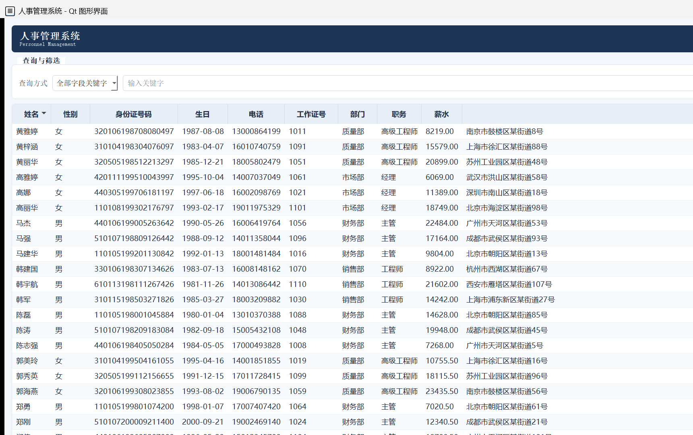
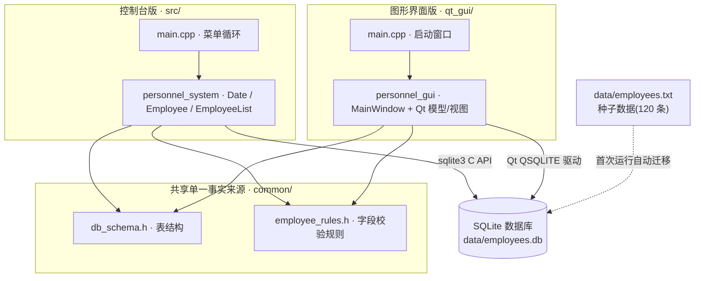
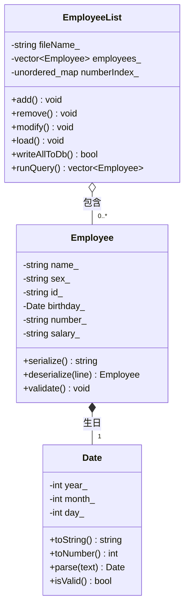
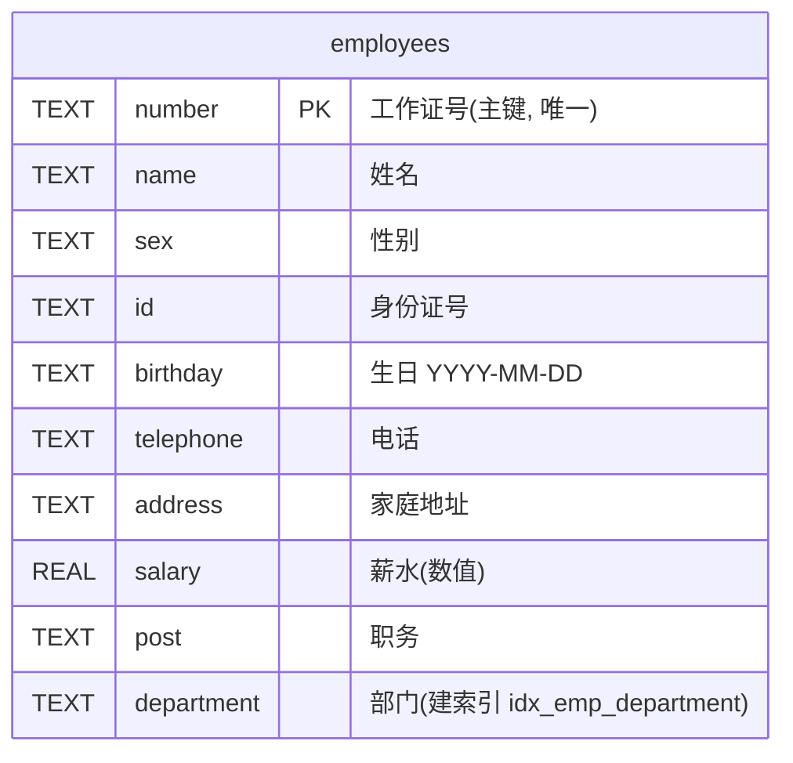
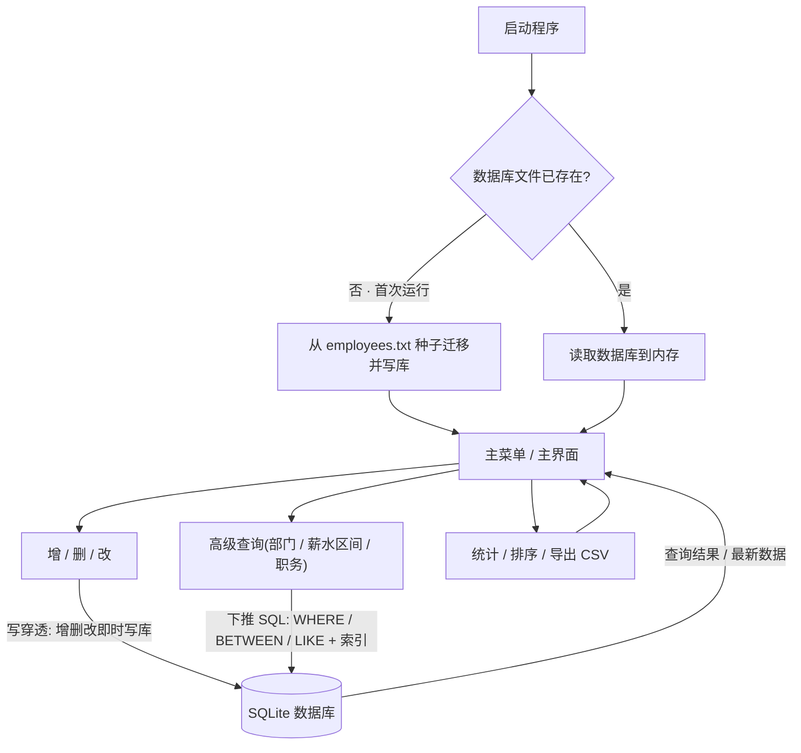

<div align="center">

# 人事管理系统 · Personnel Management System

**一套用 C++17 打造的人事管理系统,同时提供「控制台版」与「Qt 图形界面版」——两种界面功能一致、共享同一个 SQLite 数据库、数据实时互通。**

面向对象程序设计课程设计 · 演示类设计、数据库持久化、输入校验、图形界面与工程化实践

<br/>


<br/>


### [⬇️ 下载 Windows 免安装版](https://github.com/qw798124012700qw/personnel-management-system/releases/latest) &nbsp;·&nbsp; 解压双击即用,无需安装 Qt

*觉得有用的话,点个 ⭐ Star 是对我最大的鼓励 🙌*

</div>

---

> **📚 为什么这个项目值得参考?**
> 网上的"人事管理系统"大多是单文件、面向过程、用 `.txt` 存数据的控制台程序。本项目刻意做成一个**像样的小工程**:控制台 + 图形界面**双版本**、数据落到 **SQLite**、抽出**共享模块**消除重复、配上**单元测试**与 **CI / 自动发布**——既能当课程设计交付,也能当工程化入门的参考样例。

## 📑 目录

| 章节 | 内容 |
| --- | --- |
| [📖 简介](#-简介) | 项目背景、解决的问题、技术选型理由 |
| [🖥️ 界面预览](#️-界面预览) | 图形界面截图与版面说明 |
| [✨ 功能特性](#-功能特性) | 数据管理 / 查询排序 / 统计持久化 / 图形界面专属 |
| [🧩 设计与实现](#-设计与实现) | 三个核心类、模块架构图、类设计图 |
| [🛠️ 技术栈](#️-技术栈) | 语言、界面、存储、测试 / CI、设计模式 |
| [📁 项目结构](#-项目结构) | 目录树与各部分职责 |
| [🚀 快速开始](#-快速开始) | 下载即用,或从源码构建控制台版 / 图形界面版 |
| [📂 数据存储](#-数据存储) | 数据库表结构(ER 图)、种子迁移、数据格式 |
| [🏗️ 系统框架](#️-系统框架) | 总框架图与数据流 / 工作流程图 |
| [📖 使用说明](#-使用说明) | 登录、操作手册与运行环境文档 |
| [🗺️ 可改进方向](#️-可改进方向-roadmap) | 已完成清单与后续规划 |
| [📄 许可证](#-许可证) | MIT 开源协议 |

---

## 📖 简介

当企事业单位的员工信息靠纸质表格或零散电子表格维护时,常常出现**查找慢、修改不及时、数据重复、容易出错**等问题。本系统把员工资料集中管理,提供**录入、查询、修改、删除、排序、统计与数据库存取**的一站式功能,并同时给出**命令行**与**图形界面**两种使用方式,适配不同场景与习惯。

**为什么选 C++?** 面向对象特性天然适合把"员工、日期、员工列表"抽象成职责清晰的类;标准库的 `vector` / `string` 便于动态存储与字符串处理;而数据持久化交给嵌入式数据库 **SQLite**,既轻量(零配置、单文件),又能享受关系型存储的类型与索引能力。

**一句话亮点:** 同一套数据,两种界面;内存操作的高效 + 数据库存储的可靠;课程要求的面向对象 + 工业界常见的测试与 CI。

## 🖥️ 界面预览



> 上图展示了图形界面版的核心版面(含 120 条示例数据),自上而下为:**顶部标题栏**(右侧徽章显示记录数)、**查询与筛选区**、**中部员工表格**(可点列头排序、单击行回填表单)、**底部「员工信息」编辑表单**与**操作按钮区**。
>
> *(此截图取自较早版本;登录身份、分页栏、撤销 / 重做、CSV 导入、审计日志、中英切换等后续新增能力详见 [功能特性](#-功能特性)。)*

## ✨ 功能特性

按使用场景分为四类,控制台版与图形界面版**功能一致**,图形界面另有若干交互增强:

**📋 数据管理**
- 📝 员工的**增加、删除、修改**,录入即校验(身份证 15/18 位、电话、日期合法性、薪水格式;工作证号唯一)
- 📑 **显示**全部员工摘要;**清空**全部记录(需二次确认)

**🔍 查询与排序**
- 🔎 **基本查找**:按姓名(模糊)或工作证号(精确)
- 🎯 **高级查询**:按部门(精确)、薪水区间(自动校正上下限)、职务关键字(模糊);**控制台版下推到 SQL** 执行(`WHERE` / `BETWEEN` / `LIKE` + 部门索引)
- ↕️ **多字段排序**:按工作证号、生日、薪水

**📊 统计与持久化**
- 📈 **统计分析**:各部门人数;薪水总额 / 平均 / 最高 / 最低(附对应员工)
- 💾 **SQLite 数据库持久化**:控制台版走 SQLite C API、图形界面版走 Qt SQL 模块,**两种界面共用同一个数据库** `data/employees.db`;**两端均以数据库为实时数据源**(增删改即时写库,无需手动保存);**首次运行自动从旧文本文件迁移**;读取时自动跳过异常记录

**🪟 图形界面专属增强**
- 🔐 **登录与角色权限**:启动选择身份(管理员 / 只读访客),只读访客禁用一切写操作;增删改 / 撤销 / 导入均写入**审计日志**,可弹窗查看
- 🌐 **中英文界面切换**:菜单「语言 / Language」一键切换标题、按钮、表头、表单标签等
- 📄 **分页浏览**:每页 20 / 50 / 100 / 全部,上一页 / 下一页翻页(对筛选 + 排序后的结果生效)
- ↩️ **多级撤销 / 重做**:逐步回退或恢复增删改,支持快捷键 `Ctrl+Z` / `Ctrl+Y`
- 📤 **导入 / 导出 CSV**:导出 UTF-8(带 BOM,Excel / WPS 直接打开);导入时逐行校验、按工作证号去重、跳过非法行
- 📐 **记忆列宽与排序状态**:拖动列宽、点列头排序的状态在下次启动自动恢复(基于 QSettings)
- 🖱️ 单击行即回填表单编辑、点列头排序、关键字即时筛选、统计结果弹窗
- 🚪 **关窗提示**与 **高 DPI 适配** + 窗口尺寸自适应屏幕

## 🧩 设计与实现

项目以**面向对象**为核心:把现实概念抽象成职责单一、相互解耦的类,字段全部私有并以访问器暴露,体现封装。控制台版由三个核心类支撑:

| 类 | 职责 |
| --- | --- |
| `Date` | 日期的输入、格式化、合法性校验(含闰年判断) |
| `Employee` | 单个员工的字段封装、录入 / 输出 / 序列化 / 修改 |
| `EmployeeList` | 员工集合的增删改查、排序、统计与数据库读写(内部用 `vector` 顺序表 + `unordered_map` 索引) |

> **用到的 C++ / 面向对象技术点:** 封装与访问器、运算符重载(`<<` / `>>`)、函数重载、`std::sort` + 静态比较函数、STL 容器、异常处理(容错读取、自动跳过异常记录)、用哈希表把查重从 `O(n²)` 优化到 `O(n)`。

图形界面版采用 Qt 的 **模型 / 视图(MVC)** 架构:`QMainWindow` 承载界面,`QStandardItemModel` 存数据、`QSortFilterProxyModel` 做排序与筛选、`QTableView` 负责展示,按钮事件通过**信号槽**连接到业务逻辑——并与控制台版**共用同一个 SQLite 数据库**(经 Qt SQL 的 `QSQLITE` 驱动访问)。

### 模块架构

控制台版与图形界面版是**两套独立的可执行程序**,但共用 `common/` 下的**表结构**与**字段校验规则**,并读写**同一个 SQLite 数据库**——做到既各自独立、又口径一致、数据互通,从源头杜绝两端实现漂移。



### 类设计(控制台版)

三个核心类构成清晰的"**组合**"关系:`EmployeeList` 聚合多个 `Employee`,每个 `Employee` 内含一个 `Date`(生日)。下图为简化的类图:



## 🛠️ 技术栈

| 部分 | 选型 | 说明 |
| --- | --- | --- |
| **语言** | C++17 | `vector` / `string` / 异常 / STL 算法 |
| **图形界面** | Qt 5 Widgets | `qmake` 构建,模型 / 视图 + 信号槽 |
| **数据存储** | SQLite 3 | 控制台用 C API,图形界面用 Qt 5 Sql 的 `QSQLITE` 驱动;表结构集中在 `common/db_schema.h` |
| **测试 / CI** | 自带轻量断言框架(42 个断言) | `make test` 本地运行 + GitHub Actions 持续构建 + 打 tag 自动发布 |
| **设计** | 面向对象、MVC | 模型 / 视图 / 代理,共享层消除重复 |

## 📁 项目结构

代码按"控制台版 / 图形界面版 / 共享层 / 测试 / CI"清晰分层,共享层是两端一致性的关键:

```
.
├── src/                  控制台版源码
│   ├── main.cpp              菜单循环与程序入口
│   ├── personnel_system.h    Date / Employee / EmployeeList 声明
│   └── personnel_system.cpp  核心逻辑与 SQLite 读写
├── qt_gui/               图形界面版源码
│   ├── main.cpp              登录 + 启动窗口
│   ├── personnel_gui.h
│   ├── personnel_gui.cpp     MainWindow + Qt 模型/视图
│   └── personnel_gui.pro     qmake 工程(含 QT += sql)
├── common/               两端共用的单一事实来源
│   ├── db_schema.h           数据库表结构(员工表 + 审计表 + 索引)
│   └── employee_rules.h      字段校验规则(性别 / 身份证 / 电话 / 薪水)
├── tests/test_core.cpp   核心逻辑单元测试(make test)
├── .github/workflows/    GitHub Actions:ci.yml(持续构建)+ release.yml(打 tag 自动发布)
├── data/employees.txt    种子数据(120 条;首次运行自动导入 SQLite)
├── Makefile              控制台 / 测试 / 图形界面的构建脚本
├── 使用手册.md / 运行说明.md   面向用户 / 开发者的中文文档
├── architecture.png      系统总框架图
├── screenshot-gui.png    界面截图
└── README.md
```

## 🚀 快速开始

提供**三种**上手方式,按需选择:

### ① 直接下载(最快,无需任何环境)

到 [Releases](https://github.com/qw798124012700qw/personnel-management-system/releases/latest) 下载 Windows 免安装包,解压后双击 **`人事管理系统.exe`**(图形界面)或 **`人事管理系统-控制台版.exe`**(命令行)即可运行,**无需安装 Qt 或任何运行库**。

### ② 从源码构建 · 控制台版

```sh
# 需安装 SQLite 开发库(头文件 sqlite3.h + 链接 -lsqlite3)
g++ -std=c++17 -Wall -Wextra src/main.cpp src/personnel_system.cpp -o personnel_system -lsqlite3
./personnel_system
```

> 也可用 Makefile 一键完成:`make`(编译) · `make run`(编译并运行) · `make test`(运行单元测试)。

### ③ 从源码构建 · 图形界面版(需安装 Qt 5)

```sh
cd qt_gui
qmake personnel_gui.pro    # .pro 已含 QT += sql
make                       # Windows(MinGW)上用 mingw32-make
```

> 图形界面经 Qt SQL 模块访问数据库;`QSQLITE` 驱动随 Qt 提供,运行时需位于 `sqldrivers/` 目录(`make gui` 会自动部署平台插件与数据库驱动)。

## 📂 数据存储

运行数据保存在 SQLite 数据库 `data/employees.db`(两端共用,表结构集中定义于 `common/db_schema.h`)。**仅首次运行(数据库文件尚不存在)**时,会自动从同目录的**种子文本文件** `data/employees.txt` 迁移并写回数据库;数据库一旦建立,其内容即为权威——即使被清空,重启后也不会再被种子还原。

员工表 `employees` 以工作证号 `number` 为**主键**,薪水 `salary` 采用 `REAL` 数值类型(便于 SQL 区间查询与排序),并在 `department` 上建**索引**以支撑按部门检索:



> 数据库中另有 `audit_log` 表,记录图形界面版每次增 / 删 / 改 / 撤销 / 导入的操作审计(时间、身份、操作、细节),可在界面「审计日志」按钮中查看。

**种子文件格式**:UTF-8 编码,每个员工占一行,10 个字段以竖线 `|` 分隔:

```
姓名|性别|身份证号|生日(YYYY-MM-DD)|电话|工作证号|家庭地址|薪水|职务|部门
```

示例:

```
张三|男|110101199001011234|1990-01-01|13800138000|1001|北京市海淀区中关村|8500|软件工程师|研发部
```

> 字段中的 `|` 与 `\` 会被转义;迁移 / 读取时遇到字段数错误、日期非法、薪水非数字或工作证号重复的行会**自动跳过**,保证坏数据不会污染数据库。

## 🏗️ 系统框架

下图为系统的总体框架(分层与模块关系):


### 数据流与工作流程

下图描述从**启动**到**日常操作**的数据流向:启动时按"数据库是否已存在"决定是否从种子迁移;之后增删改**实时写入数据库**(写穿透),高级查询则**下推到 SQL** 直接在数据库上执行:



> **两端统一**:控制台版与图形界面版都以数据库为实时数据源——每次增 / 删 / 改(图形界面含撤销 / 重做、CSV 导入)都即时写入同一个 `data/employees.db`,无需手动保存;图形界面仍保留「保存文件」作为手动再确认。

## 📖 使用说明

完整的图文操作步骤与运行环境说明见以下文档:

- 📘 **[使用手册.md](使用手册.md)** —— 面向使用者:登录身份、各功能的操作步骤、字段录入规则、常见问题。
- 🔧 **[运行说明.md](运行说明.md)** —— 面向开发者:在 Windows / VS Code 下编译、运行、调试的完整环境说明。

> **登录提示(图形界面版)**:启动时选择身份——**管理员**(可执行全部操作,需输入演示口令 `admin123`)或 **只读访客**(仅可查看 / 查询 / 导出)。此登录为课程演示用途,非生产级安全鉴权。

## 🗺️ 可改进方向 (Roadmap)

### ✅ 已完成

- [x] 图形界面**高 DPI 适配 + 窗口尺寸自适应屏幕**
- [x] 用哈希表(`unordered_map`)为工作证号建索引,查找 / 查重 `O(n²)` → `O(1)` / `O(n)`
- [x] 数据存储改用 **SQLite**(控制台 C API + 图形界面 `QSQLITE` 驱动,共用 `data/employees.db`,首次自动迁移)
- [x] 抽出共享**数据库表结构** `common/db_schema.h` 与**字段校验规则** `common/employee_rules.h`,消除两端重复、口径统一
- [x] **两端均以数据库为实时数据源**(增删改即时写库):控制台用增量单行 SQL(`INSERT` / `UPDATE` / `DELETE`),图形界面写穿透;高级查询下推到 SQL(`WHERE` / `BETWEEN` / `LIKE` + `ORDER BY` + 部门索引)
- [x] 图形界面:**导入 / 导出 CSV**、**多级撤销 / 重做**(快捷键 Ctrl+Z / Ctrl+Y)、**记忆列宽与排序状态**(QSettings)
- [x] **登录与角色权限**(管理员 / 只读访客)+ 操作**审计日志**(写入数据库、可弹窗查看)
- [x] **国际化**:图形界面「语言 / Language」菜单一键中英切换主界面文字
- [x] 图形界面**分页浏览**(每页 20 / 50 / 100 / 全部,对筛选 + 排序后的结果翻页)
- [x] **单元测试**(自带轻量断言框架)+ **GitHub Actions CI** 持续构建
- [x] CI **打 tag 自动构建并发布 Release 包**(Windows / MSYS2-clang64 / Qt5,已由 `v1.0.1` 实跑验证)

### 🔭 下一步规划

- [ ] (可选)将分页**下推到 SQL**(`LIMIT` / `OFFSET`),以数据库为源支撑超大数据量

## 📄 许可证

本项目采用 [MIT License](LICENSE) 开源,**仅供学习与交流**。如果你也在做类似的课程设计,欢迎参考借鉴——但请勿直接抄作业 😉
</parameter>
